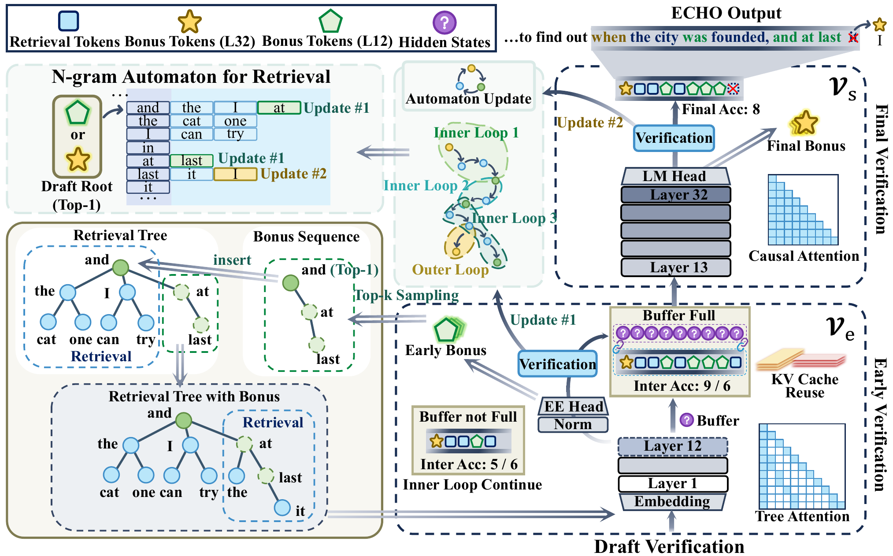

<div align="center">

# ECHO

**Early-layer Collaborative Hierarchical Orchestration with Bonus Logits in Speculative Decoding**

[](https://arxiv.org/abs/2609.17241)
[]()
[]()

</div>


## Acknowledgements

This codebase is based on [RACER](https://github.com/hkr04/RACER). Experiments use official [LayerSkip](https://github.com/facebookresearch/LayerSkip) weights.

## Overview

<p align="center">
  
</p>

Draft-model-free speculative decoding is cheap to deploy, but it hits two walls. **Verification** still runs the full target stack on every draft, so cost barely falls when drafts are wrong (the *verification wall*). **Drafts** themselves are often stale: if bonus logits come only from the last layer, they refresh only after a full forward pass, and acceptance decays quickly with depth.

ECHO’s claim is that **LayerSkip-style early-exit SFT** changes this asymmetry. After that one-shot fine-tune, shallow layers can already score candidates well enough to **take over most of the verification load**, so the deep stack is invoked much less often. The same early layers also emit **early bonus logits**—distributions that already contain substantial *future* context, not just the next token. Feeding those logits into the retrieval automaton updates drafts at high frequency and with higher quality, instead of waiting for a last-layer refresh.

Remaining layers stay the authority: they confirm what early layers accepted and supply a final bonus to re-anchor the next cycle. No extra draft model or deployment heads are added; the speedup (about \(2.4\times\)–\(2.9\times\) in the paper) comes from using LayerSkip’s early-exit capacity for verification sharing and for richer, faster automaton updates.

See the [paper](https://arxiv.org/pdf/2609.17241) for details.

## Quick Start

### 1. Download LayerSkip weights

Checkpoints are in the Hugging Face collection [facebook/layerskip](https://huggingface.co/collections/facebook/layerskip) (gated, FAIR non-commercial license). Request access, then log in:

```bash
huggingface-cli login
```

| Family | Models |
| --- | --- |
| Llama 2 | [`7B`](https://huggingface.co/facebook/layerskip-llama2-7B) · [`13B`](https://huggingface.co/facebook/layerskip-llama2-13B) · [`70B`](https://huggingface.co/facebook/layerskip-llama2-70B) |
| Llama 3 | [`8B`](https://huggingface.co/facebook/layerskip-llama3-8B) |
| Llama 3.2 | [`1B`](https://huggingface.co/facebook/layerskip-llama3.2-1B) |
| CodeLlama | [`7B`](https://huggingface.co/facebook/layerskip-codellama-7B) · [`34B`](https://huggingface.co/facebook/layerskip-codellama-34B) |

Example ([facebook/layerskip-llama3-8B](https://huggingface.co/facebook/layerskip-llama3-8B)):

```bash
huggingface-cli download facebook/layerskip-llama3-8B \
  --local-dir ./checkpoints/layerskip-llama3-8B
```

Point `--model-path` at the local directory. Official LayerSkip checkpoints are continued pretrain on **base** models, not Instruct.

### 2. Environment

Python 3.10, CUDA 11.8 (`torch==2.7.1+cu118`). System `g++` is required to build the automaton.

```bash
conda create -n echo python=3.10 -y
conda activate echo
pip install -r requirements.txt
# fschat 0.2.31 still declares pydantic<2; overlay to match the working stack
pip install pydantic==2.12.5 pydantic_core==2.41.5 fastapi==0.120.3 uvicorn==0.38.0
pip install -e ./echo/automaton
```

Rebuild the automaton if you change Python version.

### 3. Run

From the repo root. Default decode is greedy (`temperature=0`); stop is eos only. `--bench-name`: `spec_bench` | `human_eval` | `gsm8k` | `mgsm`.

```bash
CUDA_VISIBLE_DEVICES=0 python evaluation/inference_echo.py \
  --model-path ./checkpoints/layerskip-llama3-8B \
  --model-id layerskip-llama3-8B \
  --bench-name spec_bench \
  --intermediate-layer 10 \
  --verification-threshold 3 \
  --max-nodes 30000 \
  --no-bottleneck-log
```

Swap `--bench-name` for `human_eval` or `gsm8k`. Answers go to `data/<bench>/model_answer/<model-id>-echo-L{L}-T{T}_<timestamp>.jsonl`.

Vanilla AR (same prompts, no speculation):

```bash
CUDA_VISIBLE_DEVICES=0 python evaluation/inference_vanilla.py \
  --model-path ./checkpoints/layerskip-llama3-8B \
  --model-id layerskip-llama3-8B \
  --bench-name spec_bench
```

Speed vs. vanilla:

```bash
python evaluation/speed.py data/spec_bench/model_answer/<echo>.jsonl \
  --base-path data/spec_bench/model_answer/<vanilla>.jsonl
```

## Citation

```bibtex
@article{ma2026echo,
  title={ECHO: Early-layer Collaborative Hierarchical Orchestration with Bonus Logits in Speculative Decoding},
  author={Ma, Ziyang and Zhang, Zihong and Li, Zuchao and Zhang, Lefei and Qi, Baoyuan and Li, Siqi and Yu, Simin},
  journal={arXiv preprint arXiv:2609.17241},
  year={2026}
}
```
